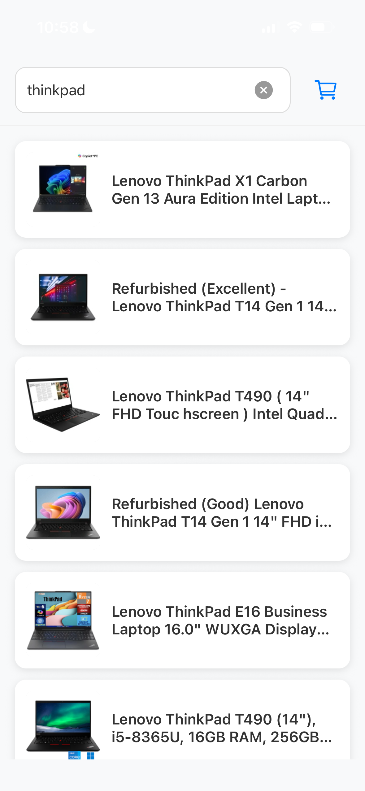
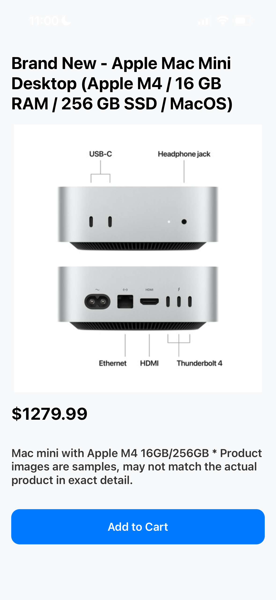
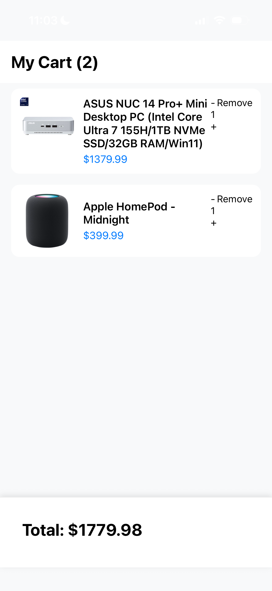

# Best Buy Demo


This is a React Native mobile app built with Expo that allows users to search products, view detailed information with media carousel, and add items to a shopping cart.

## Screenshots
<p align="center">



</p>

## Features

- Search / Generate product lists
- Product detail view with image & video support
- Horizontal swipeable media carousel
- Shopping cart with quantity management
- Add to cart from detail screen

## Tech Stack

- **Framework**: Expo (React Native)
- **Routing**: Expo Router (File-based)
- **State Management**: Zustand
- **UI**: React Native + Expo components
- **Media**: `expo-av` for video support
- **Navigation**: Native Stack

## Dependencies

### Core Dependencies
```bash
expo
expo-router
expo-av
expo-build-properties
expo-dev-client
react-native-safe-area-context
zustand
```

### Deployment

Clone this repo, then log into your Expo account:

```bash
npm install -g eas-cli
eas login
```

Install your dependencies, then follow the prompts to deploy the app:

```bash
npm install
npx expo start
```


## Known Issues

- Certain versions of Android receive an INTERNAL_ERROR from server